<!--
  ─────────────────────────────────────────────────────────────────────
  Yash Waghmare · GitHub Profile README
  Palette: #22D3EE cyan → #818CF8 indigo → #E879F9 fuchsia (aurora)

  hero.svg and stack.svg are hand-authored SVGs in ./assets — nothing
  in this file's identity depends on a third-party image service that
  can rate-limit or 404.

  They are single dark cards, not dark/light pairs, on purpose: the
  aurora needs a dark ground to read, and a self-contained dark card
  is deliberate on GitHub's light theme. One file per graphic also
  means no prefers-color-scheme path that can break on its own.
  ─────────────────────────────────────────────────────────────────────
-->

<p align="center">
  
</p>

<p align="center">
  <a href="https://yash-waghmare.netlify.app"></a>
  <a href="https://linkedin.com/in/waghmareyash07"></a>
  <a href="mailto:w.prakash@iitg.ac.in"></a>
  
</p>

<br />

## &nbsp;⬢&nbsp; whoami

```ts
const yash: Developer = {
  education : "B.Tech, Mechanical Engineering @ IIT Guwahati",
  role      : "WebOps Head @ Spirit — IITG's sports festival",
  building  : ["Wanderlust  · MERN travel platform",
               "NexaVault   · React 19 finance dashboard",
               "VectorShift · React + FastAPI pipelines"],
  learning  : ["DSA", "System Design", "Motion & UI/UX"],
  askMeAbout: ["React", "Node / Express", "MongoDB", "UI/UX"],
  goal      : "Ship products people actually enjoy using ✨",
};
```

<br />

## &nbsp;⬢&nbsp; Toolbox

<p align="center">
  
</p>

<br />

## &nbsp;⬢&nbsp; Featured Work

<table>
<tr>
<td width="50%" valign="top">

### 🌍 &nbsp;Wanderlust

Full-stack **MERN** travel platform — publish, browse and review stays.

- 🔐 Session-based auth with route-level guards
- 🧭 RESTful Express APIs + server-side validation
- 🗄️ Mongo schemas for listings, reviews, users
- 📱 Fully responsive UI

<code>Node</code> <code>Express</code> <code>MongoDB</code> <code>EJS</code>

**[↗ Live](https://wanderlust-fuiy.onrender.com)** &nbsp;·&nbsp; **[↗ Code](https://github.com/yash07-bit/wanderlust)**

</td>
<td width="50%" valign="top">

### 💰 &nbsp;NexaVault

Personal finance dashboard on **React 19**, with real data flowing through it.

- 📥 Excel (XLSX) import for transactions
- 🔄 Bidirectional sync across every page
- 📊 Budgets, insights, reports, monthly trends
- 💱 Multi-currency (USD / EUR / GBP)

<code>React 19</code> <code>Tailwind</code> <code>Vite</code>

**[↗ Live](https://nexa-vault-three.vercel.app)** &nbsp;·&nbsp; **[↗ Code](https://github.com/yash07-bit/Finance-Dashboard)**

</td>
</tr>
<tr>
<td width="50%" valign="top">

### 🔀 &nbsp;VectorShift

Visual **drag-and-drop** builder for data-processing pipelines.

- 🎨 Node canvas — LLM, API, Math, Filter, Delay types
- 🔍 Auto variable detection from `{{ template }}` syntax
- 🔗 Dynamic handles with automatic edge cleanup
- ✅ DAG validation on submit

<code>React</code> <code>FastAPI</code> <code>Python</code>

**[↗ Code](https://github.com/yash07-bit/VectorShift)**

</td>
<td width="50%" valign="top">

### ♻️ &nbsp;Smart Waste Classifier

Type a waste item, get its category and disposal guidance instantly.

- 🧠 Rule-based classifier — wet / dry / e-waste
- 🎞️ Framer Motion transitions throughout
- 💡 Example chips + educational category section
- 📱 Animated, responsive landing

<code>React</code> <code>Vite</code> <code>Tailwind</code>

**[↗ Code](https://github.com/yash07-bit/waste_type_detector)**

</td>
</tr>
</table>

<br />

## &nbsp;⬢&nbsp; Experience

<details open>
<summary><b>🌐 &nbsp;WebOps Head — Spirit, IIT Guwahati</b> &nbsp;·&nbsp; <i>present</i></summary>
<br />

- Leading web operations for one of IIT Guwahati's flagship festivals
- Designing and shipping the festival's digital experience end to end
- Shipping features to <a href="https://github.com/spiritiitg/CA_PORTAL"><code>spiritiitg/CA_PORTAL</code></a> through reviewed pull requests
- Coordinating across design, content and dev to keep releases predictable

</details>

<details>
<summary><b>📈 &nbsp;Data Analytics Virtual Internship — Deloitte Australia</b></summary>
<br />

- Analysed transaction datasets in **Excel** to surface anomalies
- Built interactive **Tableau** dashboards for business stakeholders
- Translated raw data into decision-ready insights

</details>

<br />

## &nbsp;⬢&nbsp; Activity

<p align="center">
  
  
</p>

<p align="center">
  
</p>

<!--
  Snake is generated by .github/workflows/snake.yml into the `output`
  branch. No width="100%" on purpose: the SVG is 880x192, already about
  GitHub's content width, so a failed load shows a small box rather than
  a giant empty one.
-->
<p align="center">
  <picture>
    <source media="(prefers-color-scheme: dark)" srcset="https://raw.githubusercontent.com/yash07-bit/yash07-bit/output/snake-dark.svg" />
    <source media="(prefers-color-scheme: light)" srcset="https://raw.githubusercontent.com/yash07-bit/yash07-bit/output/snake-light.svg" />
    
  </picture>
</p>

<br />

## &nbsp;⬢&nbsp; Let's Build Something

<p align="center">
  <i>Open to Software Engineering internships and interesting frontend problems.</i>
</p>

<p align="center">
  <a href="mailto:w.prakash@iitg.ac.in"></a>
  <a href="https://linkedin.com/in/waghmareyash07"></a>
  <a href="https://yash-waghmare.netlify.app"></a>
</p>

<p align="center"><sub>Always learning, building, improving.</sub></p>
