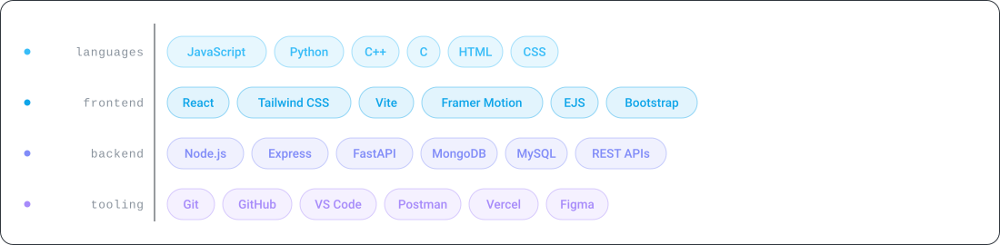

<!--
  ─────────────────────────────────────────────────────────────
  Yash Waghmare · GitHub Profile README
  Banner + stack graphics are hand-authored SVGs in ./assets —
  self-hosted, so nothing here depends on a third-party image
  service that can rate-limit or go down.
  Each has a dark and a light variant, swapped via <picture>.
  ─────────────────────────────────────────────────────────────
-->

<picture>
  <source media="(prefers-color-scheme: dark)" srcset="./assets/banner-dark.svg" />
  <source media="(prefers-color-scheme: light)" srcset="./assets/banner-light.svg" />
  
</picture>

<p align="center">
  <a href="https://yash-waghmare.netlify.app"></a>
  <a href="https://linkedin.com/in/waghmareyash07"></a>
  <a href="mailto:w.prakash@iitg.ac.in"></a>
  
</p>

<br />

## &nbsp;`~` &nbsp;whoami

```ts
const yash = {
  education   : "B.Tech, Mechanical Engineering @ IIT Guwahati",
  currentRole : "WebOps Head @ Spirit — IIT Guwahati's sports festival",
  building    : ["Wanderlust · MERN travel platform",
                 "NexaVault · React 19 finance dashboard",
                 "spirit.iitg.ac.in"],
  learning    : ["Data Structures & Algorithms", "System Design", "Motion & UI/UX"],
  askMeAbout  : ["React", "Node / Express", "MongoDB", "Interactive web experiences"],
  goal        : "Ship products people actually enjoy using ✨",
};
```

<br />

## 🧰 &nbsp;Toolbox

<picture>
  <source media="(prefers-color-scheme: dark)" srcset="./assets/stack-dark.svg" />
  <source media="(prefers-color-scheme: light)" srcset="./assets/stack-light.svg" />
  
</picture>

<br />

## 🚀 &nbsp;Featured Work

<table>
<tr>
<td width="50%" valign="top">

### 🌍 &nbsp;Wanderlust

Full-stack **MERN** travel listing app — publish, browse and review stays.

- 🔐 Session-based auth with route-level guards
- 🧭 RESTful Express APIs + server-side validation
- 🗄️ Mongo schemas for listings, reviews, users
- 📱 Fully responsive UI

`Node` `Express` `MongoDB` `EJS` `Bootstrap`

**[Live ↗](https://wanderlust-fuiy.onrender.com)** &nbsp;·&nbsp; **[Code ↗](https://github.com/yash07-bit/wanderlust)**

</td>
<td width="50%" valign="top">

### 💰 &nbsp;NexaVault — Finance Dashboard

Personal finance manager built on **React 19**, with real data flowing through it.

- 📥 Excel (XLSX) import for transactions
- 🔄 Bidirectional sync across every page
- 📊 Budgets, insights, reports, monthly trends
- 💱 Multi-currency (USD / EUR / GBP)

`React 19` `Tailwind` `Vite`

**[Live ↗](https://nexa-vault-three.vercel.app)** &nbsp;·&nbsp; **[Code ↗](https://github.com/yash07-bit/Finance-Dashboard)**

</td>
</tr>
<tr>
<td width="50%" valign="top">

### 🔀 &nbsp;VectorShift — Pipeline Builder

Visual **drag-and-drop** builder for data-processing workflows.

- 🎨 Node canvas with 9 node types (LLM, API, Filter…)
- 🔍 Auto variable detection from `{{ template }}` syntax
- 🔗 Dynamic handles + auto edge cleanup
- ✅ DAG validation on submit

`React` `FastAPI` `Python`

**[Code ↗](https://github.com/yash07-bit/VectorShift)**

</td>
<td width="50%" valign="top">

### ♻️ &nbsp;Smart Waste Classifier

Type a waste item, get its category and disposal guidance instantly.

- 🧠 Rule-based classifier — wet / dry / e-waste
- 🎞️ Framer Motion transitions throughout
- 💡 Example chips + educational category section
- 📱 Animated, responsive landing

`React` `Vite` `Tailwind` `Framer Motion`

**[Code ↗](https://github.com/yash07-bit/waste_type_detector)**

</td>
</tr>
</table>

<br />

## 💼 &nbsp;Experience

<details open>
<summary><b>🌐 &nbsp;WebOps Head — Spirit, IIT Guwahati</b> &nbsp;·&nbsp; <i>present</i></summary>
<br />

- Leading web operations for one of IIT Guwahati's flagship festivals
- Designing and shipping the festival's digital experience end to end
- Coordinating across design, content and dev to keep releases predictable

</details>

<details>
<summary><b>📈 &nbsp;Data Analytics Virtual Internship — Deloitte Australia</b></summary>
<br />

- Analysed transaction datasets in **Excel** to surface anomalies
- Built interactive **Tableau** dashboards for business stakeholders
- Translated raw data into decision-ready insights

</details>

<br />

## 📊 &nbsp;GitHub Activity

<p align="center">
  
  
</p>

<p align="center">
  
</p>

<!--
  The snake below is generated by .github/workflows/snake.yml into the
  `output` branch. It stays blank until that workflow runs once —
  Actions tab → "Generate Contribution Snake" → Run workflow.
-->
<picture>
  <source media="(prefers-color-scheme: dark)" srcset="https://raw.githubusercontent.com/yash07-bit/yash07-bit/output/github-snake-dark.svg" />
  <source media="(prefers-color-scheme: light)" srcset="https://raw.githubusercontent.com/yash07-bit/yash07-bit/output/github-snake.svg" />
  
</picture>

<br />

## 💬 &nbsp;Let's Build Something

<p align="center">
  <i>Open to Software Engineering internships and interesting frontend problems.</i>
</p>

<p align="center">
  <a href="mailto:w.prakash@iitg.ac.in"></a>
  <a href="https://linkedin.com/in/waghmareyash07"></a>
  <a href="https://yash-waghmare.netlify.app"></a>
</p>

<p align="center"><sub>Always learning, building, improving.</sub></p>
