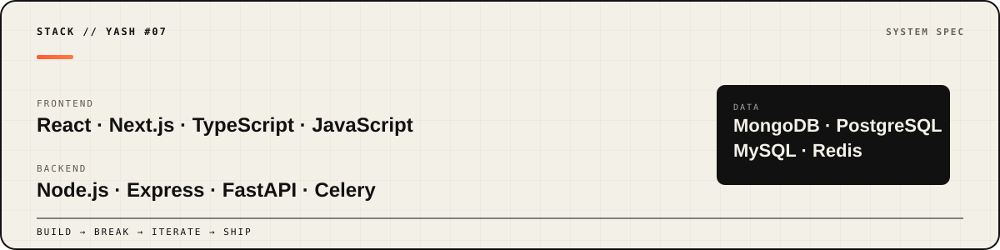

<!--
  YASH #07 · ENGINEERING FIELD NOTES
  Portfolio DNA, GitHub-native presentation.
-->

  

  <a href="https://yash-waghmare.netlify.app"><b>PORTFOLIO</b></a>
  &nbsp;·&nbsp;
  <a href="https://linkedin.com/in/waghmareyash07"><b>LINKEDIN</b></a>
  &nbsp;·&nbsp;
  <a href="mailto:waghmareyash07@gmail.com"><b>EMAIL</b></a>

 

## 01 / ENGINEERING LOG

<table>
  <tr>
    <td valign="top" width="62%">
      
LOG 001 // SYSTEM // ACTIVE

      <h2>Mechanical engineer by degree. Web developer by obsession.</h2>
      

        I build interfaces, systems, and products that live between engineering and design.
        My work sits in the space between thoughtful frontend craftsmanship and backend reliability.
      

      

        I’m <b>Yash Waghmare</b>, a <b>Full-Stack / Web Developer</b> from <b>IIT Guwahati</b>.
        I currently lead web for <b>Spirit, IIT Guwahati</b> as <b>WebOps Head</b>, and also work as a
        <b>Senior Web Developer</b> with the Students’ Web Committee.
      

    </td>
    <td valign="top" width="38%">
      <pre><code>SYS://YASH.WAGHMARE
ID://#07
STATUS://BUILDING
MODE://SHIPPING
LOCATION://IIT GUWAHATI
FOCUS://FRONTEND · BACKEND · SYSTEMS</code></pre>
    </td>
  </tr>
</table>

 

## 02 / SELECTED BUILDS

### 01 · VELORA

<table>
  <tr>
    <td valign="top" width="60%">
      
<b>Fleet routing & optimisation</b>

      

        A full-stack logistics and route optimisation system built around constraints, feasibility,
        and operational clarity.
      

      

        <code>Next.js</code> <code>FastAPI</code> <code>Celery</code> <code>Redis</code>
        <code>VROOM</code> <code>PostgreSQL</code> <code>OSRM</code>
      

    </td>
    <td valign="top" width="40%">
      
TYPE // FULL-STACK

      
<a href="https://github.com/yash07-bit/optimization-main">SOURCE</a>

    </td>
  </tr>
</table>

### 02 · WANDERLUST

<table>
  <tr>
    <td valign="top" width="60%">
      
<b>Full-stack travel platform</b>

      

        A complete stays experience with listing flows, auth, reviews, search, and deployment-ready backend logic.
      

      

        <code>Node.js</code> <code>Express</code> <code>MongoDB</code> <code>EJS</code>
      

    </td>
    <td valign="top" width="40%">
      
TYPE // PRODUCT

      
<a href="https://github.com/yash07-bit/wanderlust">SOURCE</a> · <a href="https://wanderlust-fuiy.onrender.com">LIVE</a>

    </td>
  </tr>
</table>

### 03 · RESUME BUILDER

<table>
  <tr>
    <td valign="top" width="60%">
      
<b>React-based resume builder</b>

      

        A frontend experience built for Students’ Web Committee workflows and repeatable document generation.
      

      

        <code>React</code> <code>JavaScript</code> <code>Frontend</code>
      

    </td>
    <td valign="top" width="40%">
      
TYPE // FRONTEND

      
<a href="https://github.com/yash07-bit/resume-builder">SOURCE</a>

    </td>
  </tr>
</table>

### 04 · NEXAVAULT

<table>
  <tr>
    <td valign="top" width="60%">
      
<b>Personal finance dashboard</b>

      

        Budgeting and reporting interface focused on clarity, structure, and fast financial decision-making.
      

      

        <code>React 19</code> <code>Tailwind CSS</code> <code>Vite</code> <code>Recharts</code>
      

    </td>
    <td valign="top" width="40%">
      
TYPE // DASHBOARD

      
<a href="https://github.com/yash07-bit/Finance-Dashboard">SOURCE</a> · <a href="https://nexa-vault-three.vercel.app">LIVE</a>

    </td>
  </tr>
</table>

 

## 03 / STACK

  

<table>
  <tr>
    <td width="20%"><b>FRONTEND</b></td>
    <td>React · Next.js · JavaScript · TypeScript · Tailwind CSS</td>
  </tr>
  <tr>
    <td width="20%"><b>BACKEND</b></td>
    <td>Node.js · Express · FastAPI · Celery · REST APIs</td>
  </tr>
  <tr>
    <td width="20%"><b>DATA</b></td>
    <td>MongoDB · PostgreSQL · MySQL · Redis</td>
  </tr>
  <tr>
    <td width="20%"><b>ENGINEERING</b></td>
    <td>System Design · DSA · Performance · Caching · Queues</td>
  </tr>
  <tr>
    <td width="20%"><b>TOOLS</b></td>
    <td>Git · GitHub · Figma · Vercel · Render · VS Code</td>
  </tr>
</table>

 

## 04 / EXPERIENCE

<ul>
  <li><b>2026 → NOW</b> — <b>WebOps Head</b> · Spirit, IIT Guwahati</li>
  <li><b>2026 → NOW</b> — <b>Senior Web Developer</b> · Students' Web Committee</li>
  <li><b>2026</b> — <b>Bronze Medal</b> · Kriti Inter-Hostel Tech Competition</li>
  <li><b>2026</b> — <b>Data Analytics Virtual Internship</b> · Deloitte Australia</li>
</ul>

 

## 05 / ENGINEERING LOG

<ul>
  <li><b>LOG 001</b> — Designing interfaces that feel effortless while the system underneath stays honest.</li>
  <li><b>LOG 002</b> — Fleet optimisation taught me that the real work is constraint handling, not just “smart” code.</li>
  <li><b>LOG 003</b> — Good backend systems disappear into the product experience.</li>
  <li><b>LOG 004</b> — Shipping production software means balancing polish, reliability, and speed.</li>
</ul>

 

## 06 / BUILD LOOP

  <b>BUILD</b> → <b>BREAK</b> → <b>ITERATE</b> → <b>SHIP</b> → <b>REPEAT</b>

  I care about systems that are clear, useful, and resilient — not just visually impressive.

 

## 07 / ACTIVITY

  

  

  

  <picture>
    <source media="(prefers-color-scheme: dark)" srcset="https://raw.githubusercontent.com/yash07-bit/yash07-bit/output/snake-dark.svg" />
    <source media="(prefers-color-scheme: light)" srcset="https://raw.githubusercontent.com/yash07-bit/yash07-bit/output/snake-light.svg" />
    
  </picture>

 

## 08 / OPEN TO BUILD

  <b>FULL-STACK SYSTEMS</b> · <b>FRONTEND ENGINEERING</b> · <b>INTERESTING PROBLEMS</b>

  <a href="https://yash-waghmare.netlify.app"><b>PORTFOLIO</b></a>
  &nbsp;·&nbsp;
  <a href="https://linkedin.com/in/waghmareyash07"><b>LINKEDIN</b></a>
  &nbsp;·&nbsp;
  <a href="mailto:waghmareyash07@gmail.com"><b>EMAIL</b></a>

YASH #07 · BUILD → BREAK → ITERATE → SHIP → REPEAT

